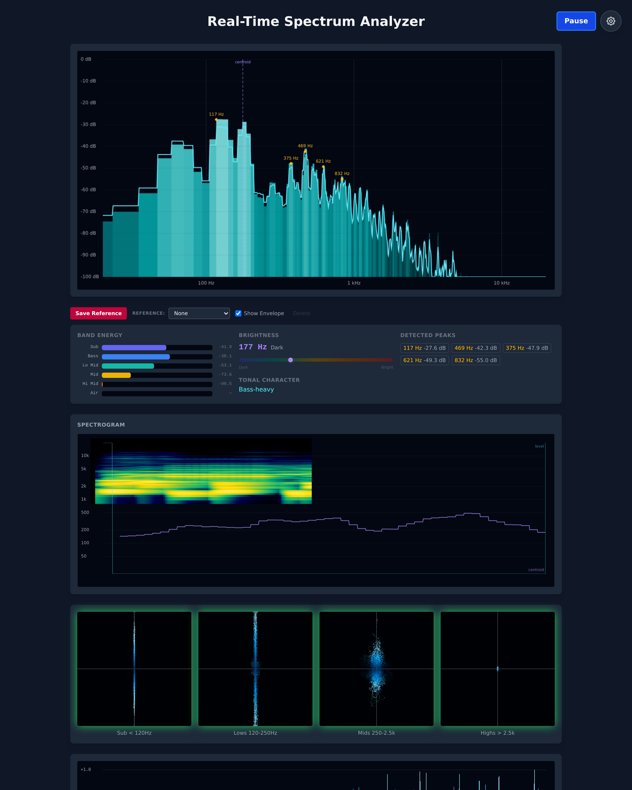

# LinkedIn Post

---

**Built a real-time audio frequency analyzer in vanilla JavaScript — no frameworks, no build step.**

A tool for music producers and sound designers to see exactly what's happening in their audio: spectral balance, resonances, stereo behavior, and how a track stacks up against a reference.

What's inside:
- Real-time FFT spectrum on a logarithmic frequency axis (20 Hz – 20 kHz)
- Scrolling spectrogram with perceptual color mapping
- Band-energy summary, spectral centroid, and peak detection
- Multi-band stereo vectorscope (Sub / Lows / Mids / Highs) with phase correlation
- Reference comparison via percentile spectral envelopes — not single snapshots

Built on the Web Audio API and Canvas 2D, rendered at 60 fps with a clean separation between the audio pipeline, derived metrics, and visualization layer.

Code: github.com/TGALLOWAY1/Realtime-Spectrum-Analyzer

#FrontendEngineering #WebAudio #JavaScript #DSP #AudioVisualization
